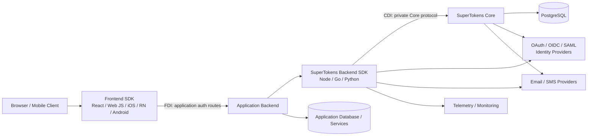
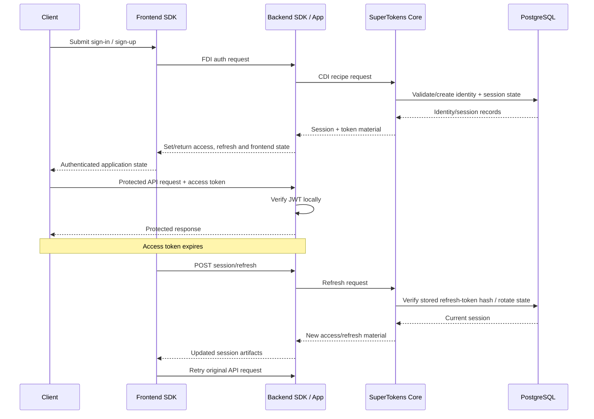
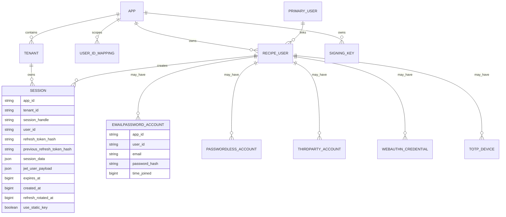
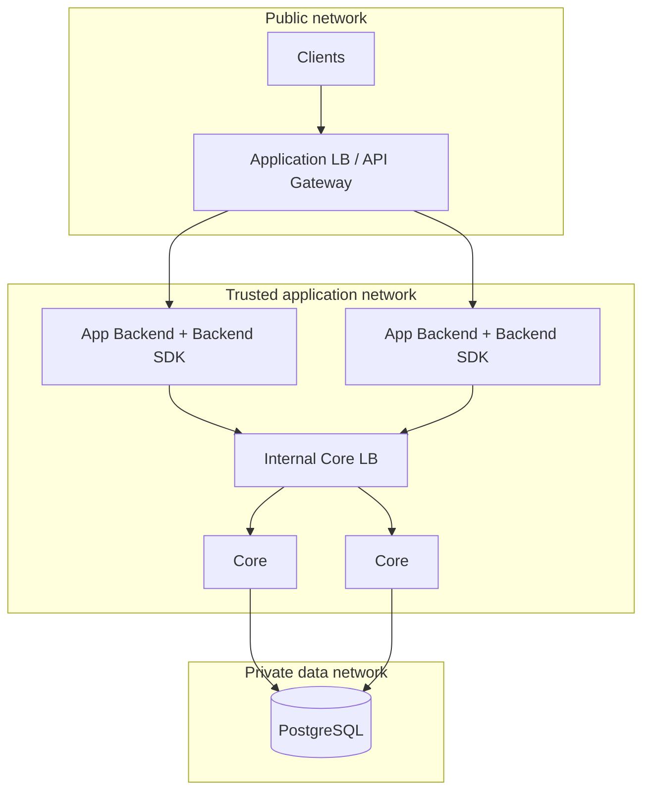
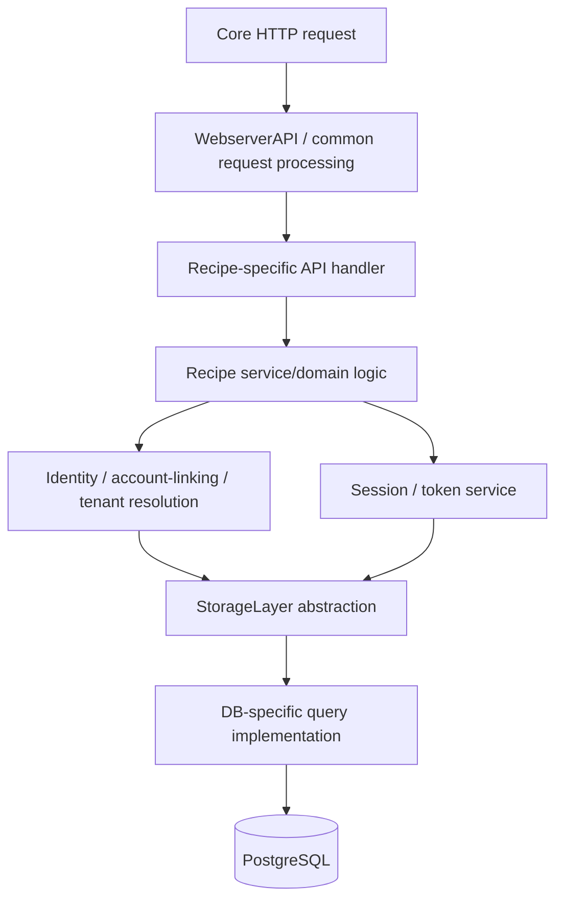
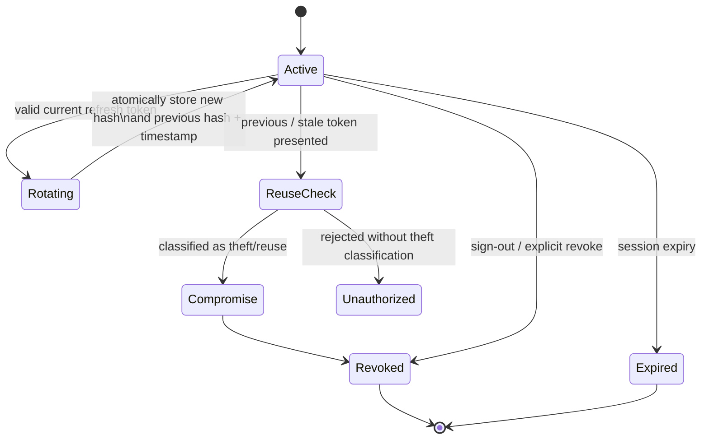
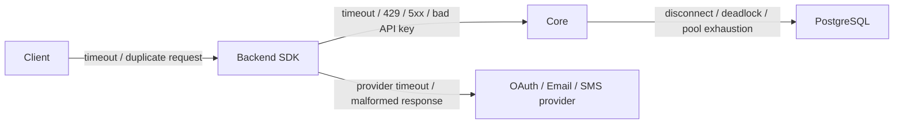

# SuperTokens Documentation and Reverse-Engineering Report

## Executive summary

This report analyzes the current SuperTokens documentation and its linked/open-source primary sources as of **September 8, 2026**. The product is best understood as a three-tier authentication system: a frontend SDK talks only to authentication routes exposed by the application backend; a backend SDK implements those routes and communicates with the **SuperTokens Core**; and the Core owns authentication/session state in its database. The documentation explicitly says the Core is a trusted backend component that should not be publicly exposed. Functionality is divided into modular “recipes,” including email/password, passwordless, social login, enterprise SSO, passkeys/WebAuthn, sessions, MFA, roles, multitenancy, account linking, metadata, dashboard functionality, OAuth/OIDC, and related features. citeturn13view0

The current reference surface is substantial. The documentation navigation exposes **49 Frontend Driver Interface operations** and, by my count from the current Core Driver Interface reference, **156 Core Driver Interface operations**, for **205 documented HTTP-operation entries**, including deprecated, administrative, diagnostic, and license-related endpoints. The FDI is the application-facing protocol generally mounted under the configured `apiBasePath`; the CDI is the backend-SDK-to-Core protocol and includes explicit application/tenant addressing, API-version negotiation, recipe identifiers, and optional API-key authentication. citeturn23view0

The supported frontend SDKs listed in the current primary frontend reference are **React, vanilla JavaScript, iOS, React Native, and Android**. The backend reference lists **Node.js, Go, and Python**. The reference surface also documents fourteen current `@supertokens-plugins/*` packages covering CAPTCHA, OpenTelemetry, profile management/progressive profiling, tenant discovery/management, and user banning. citeturn23view0turn14view4

The session architecture is hybrid rather than purely stateless. **Access tokens are JWTs and are normally verified locally by the backend SDK**, avoiding a Core/database lookup on every authenticated request; **refresh is stateful** and requires the Core. The browser/session layer maintains access and refresh artifacts plus frontend and anti-CSRF state. The open-source Core's session schema shows that it stores a **hash of the current refresh token, a previous refresh-token hash, rotation time, database session data, JWT payload data, expiration, user ID, app/tenant IDs, and signing-key mode**. This provides unusually strong primary-source evidence for how refresh rotation, revocation, and reuse detection work internally. citeturn23view3turn22view1 fileciteturn6file0L2-L2

For self-hosting, **PostgreSQL is the current supported persistent database**; MySQL/MongoDB support was dropped in Core 11.0.0. SuperTokens recommends keeping the Core private, authenticating backend-to-Core traffic with an API key, protecting network access, using TLS through an external reverse proxy when needed, and pinning an exact Core image/version rather than relying on an untagged latest image. Without PostgreSQL configuration, the Core can use an in-memory database, but the docs characterize that as a testing/development path rather than production persistence. citeturn14view0turn18view5

The most important reverse-engineering conclusion is that **there is no technical need to reverse-engineer the Core from opaque binaries**: the Core and much of the ecosystem are public source, and the Core itself is distributed under Apache License 2.0. A disciplined implementation study should therefore use source inspection, schema extraction, local traffic tracing, and behavioral/differential testing rather than decompilation or probing systems not owned by the researcher. fileciteturn9file1L21-L38

The principal engineering risks are not cryptographic novelty but **integration boundaries**: accidentally exposing the CDI/Core, tenant authorization mistakes, mismatch between frontend and backend path/domain settings, session disruption when changing `apiBasePath`, insufficient production email/SMS infrastructure, poorly planned migration of old sessions, incompatibility between Core and SDK/API versions, and assuming local JWT verification makes the entire auth platform stateless. The docs also have some low-visibility/version-sensitive controls in the source tree that deserve explicit qualification tests rather than blind dependence on documentation alone. citeturn23view0turn14view0turn22view4turn22view5

## Documented product surface, SDKs, integrations, APIs, and samples

**Feature catalog.** The documentation's present navigation organizes the platform into authentication methods, additional verification/security, post-authentication/user lifecycle capabilities, integrations, migration, platform configuration, and deployment. The following table normalizes that navigation into an implementation inventory. citeturn13view0turn20view0

| Area | Documented capabilities |
|---|---|
| Email/password | Setup; customized sign-in and sign-up; function/API hooks and overrides; password hashing; username-based login customization; password reset; disabling sign-up; password-manager behavior |
| Passwordless | OTP and magic-link authentication; setup; custom behavior; email/SMS delivery customization; invitation links; allow-listing |
| Social authentication | Built-in providers; custom providers; hooks/overrides; multiple provider clients; invitations |
| Enterprise authentication | Multitenancy; tenant discovery; per-tenant configuration; applications; SAML; legacy SAML compatibility; common-domain and subdomain patterns |
| Unified Login | OAuth 2.0/OIDC-oriented centralized login; shared/separate backend patterns; desktop/mobile reuse; scopes; token verification; custom claims |
| Machine-to-machine | Client-credentials-oriented M2M authentication and legacy migration/support material |
| Passkeys | WebAuthn/passkey concepts, setup, authentication, registration, recovery, credential management, customization |
| MCP authentication | A currently documented beta authentication area for MCP-oriented use cases |
| Sessions | Backend and frontend verification; SSR; WebSockets; session claims; revocation; cookie/header transfer; subdomain sharing; anonymous sessions; impersonation; iframe cases; error handling; multiple API endpoints; frontend interceptor controls; access-token blacklisting |
| MFA | OTP, TOTP, passkeys/WebAuthn, recovery codes, step-up authentication, per-user/all-user policies, route/UI protection |
| Email verification | Verification status, sending/consuming verification links, route protection, manual actions, UI embedding/customization |
| Attack Protection | Risk-assessment framework including brute force, breached-password, impossible-travel, bot, suspicious-IP and device-oriented signals |
| Authorization | User roles, role permissions, route/API protection |
| CAPTCHA | Plugin-supported CAPTCHA integration |
| User management | Search/list/update users, self-service profile changes, metadata, account deduplication, banning, progressive profiling |
| Account linking | Automatic/manual linking, social-account linking, adding passwords, primary/recipe-user concepts |
| Dashboard | Dashboard deployment/setup, user management, sessions, tenant management |
| Post-login routing | Custom redirect behavior after authentication |
| Delivery | Built-in, SMTP/custom email delivery; built-in/Twilio/custom SMS |
| Migration | Account migration, session migration, legacy user creation/mapping, email-verification state, password hashes/no-hash users, user data, sessions, MFA, Rownd migration |
| Platform controls | Core API keys, Core IP filters, reverse-proxy TLS, API base path, CLI |
| Deployment | Self-hosting, rate limiting, scalability, OpenTelemetry, database migration from historical MySQL setups |

Enterprise functionality includes tenant-oriented isolation, separately configurable login methods and user pools. MFA currently covers OTP, TOTP, and WebAuthn/passkeys; the MFA documentation describes it as a paid capability while allowing development evaluation. Attack Protection is documented as beta and disabled by default. citeturn21view1turn20view1turn21view0

**Social-provider catalog.** The current built-in-provider documentation lists **Google, Google Workspaces, Apple, Discord, Facebook, GitHub, GitLab, Twitter, LinkedIn, Okta, SAML, and Active Directory**, in addition to support for defining custom providers. Provider configuration examples are presented for the supported backend languages. Apple's flow receives additional treatment because of its callback behavior. citeturn19view0

### SDK and extension comparison

| Surface | Current documented SDK/package | Primary responsibilities | Main customization surface |
|---|---|---|---|
| React frontend | `supertokens-auth-react` | Prebuilt/custom authentication UI, frontend session behavior | Function overrides, hooks, React-component overrides, styling, themes, translations |
| JavaScript frontend | `supertokens-web-js` | Framework-independent browser authentication/session client | Function overrides/hooks and API interaction |
| iOS | `supertokens-ios` | Native client session/auth integration | Native SDK APIs |
| React Native | `supertokens-react-native` | Mobile cross-platform auth/session integration | Native/mobile SDK APIs |
| Android | `supertokens-android` | Native Android auth/session integration | Native SDK APIs |
| Node.js backend | `supertokens-node` | Route middleware, recipes, session verification, Core communication | Recipe-function overrides, API overrides, user context, plugins |
| Go backend | `supertokens-golang` | Same backend/Core boundary in Go applications | Recipe/function/API customization |
| Python backend | `supertokens-python` | Same backend/Core boundary in Python applications/frameworks | Recipe/function/API customization |

The frontend list and UI/customization mechanisms above are the ones named by the current reference. The backend reference separately documents Node.js, Go, and Python and exposes function/API override mechanisms rather than requiring applications to call the CDI directly. citeturn23view0turn14view4

The plugin reference currently names the following packages. citeturn23view0

| Plugin family | Packages |
|---|---|
| CAPTCHA | `@supertokens-plugins/captcha-nodejs`, `@supertokens-plugins/captcha-react` |
| Observability | `@supertokens-plugins/opentelemetry-nodejs` |
| Profile foundations/details | `@supertokens-plugins/profile-base-react`, `profile-details-nodejs`, `profile-details-react` |
| Progressive profiling | `progressive-profiling-nodejs`, `progressive-profiling-react` |
| Tenant discovery | `tenant-discovery-nodejs`, `tenant-discovery-react` |
| Tenant administration/UI | `tenants-nodejs`, `tenants-react` |
| User banning | `user-banning-nodejs`, `user-banning-react` |

The integration guides cover **AWS Lambda, AWS AppSync/session usage, GraphQL, Hasura, NestJS, Netlify, Next.js App Router and Pages Router patterns, Supabase, and Vercel**. These are integrations around the backend/frontend SDK model rather than separate authentication servers. citeturn13view0

### Frontend Driver Interface catalog

The current FDI reference contains the following **49 operation entries**. “Deprecated” is retained because those operations remain part of the documented compatibility surface. The literal prefix is configurable: authentication APIs normally appear below `apiBasePath`, whose default is `/auth`; some recipes additionally carry tenant information. citeturn23view0

| Recipe | Documented FDI operations |
|---|---|
| App | `GET` Test authentication |
| EmailPassword | `GET` Check email exists; `GET` Check email exists **deprecated**; `POST` Generate password reset token; `POST` Reset user password; `POST` Sign in with email; `POST` Sign up with email |
| EmailVerification | `GET` Check verification status; `POST` Send verification; `POST` Verify email |
| JWT | `GET` Get JWT keys |
| MultiFactorAuth | `PUT` Get MFA factors information |
| Multitenancy | `GET` Get enabled login methods |
| OAuth2Provider | `GET` Continue OAuth login; `POST` End OAuth session; `GET` End-session redirect; `POST` Exchange OAuth grant; `GET` Get OAuth login info; `GET` Get OAuth user info; `POST` Introspect OAuth token; `POST` Logout OAuth user; `POST` Revoke OAuth token; `GET` Start OAuth login |
| OpenId | `GET` Get OpenID config |
| Passwordless | `GET` Check email exists; deprecated email check; `GET` Check phone exists; deprecated phone check; `POST` Complete passwordless sign-in/up; `POST` Resend code; `POST` Start passwordless sign-in/up |
| Session | `POST` Refresh user session; `POST` Sign out |
| ThirdParty | `GET` Get third-party auth URL; `POST` Handle Apple sign-in; `POST` Third-party sign-in/up |
| TOTP | `POST` Create device; `GET` List devices; `POST` Remove device; `POST` Verify code; `POST` Verify device |
| WebAuthn | `GET` Check email exists; `POST` Generate recovery token; `POST` Get registration options; `POST` Get sign-in options; `POST` Recover account; `POST` Register credential; `POST` Sign in; `POST` Sign up |

For example, the documented email/password sign-in operation is routed through an application auth path rather than directly to Core, and the refresh operation follows the `/{apiBasePath}/session/refresh` pattern. citeturn16view0turn17view0

### Core Driver Interface catalog

The current CDI reference contains **156 operation entries** by this inventory. These include internal/backend SDK operations that a normal client application should **not** expose directly to browsers. citeturn23view0

| Recipe / subsystem | Documented CDI operations |
|---|---|
| Core | `DELETE` hello; `DELETE` license key; `POST` delete user; `GET` active-user count; `GET` API version; `GET` config-file path; `GET` enterprise features; `GET` hello; `GET` root hello; `GET` license key; `GET` request stats; `GET` search tags; `GET` telemetry ID; `GET` user ID; `GET` users; `GET` users by account info; `GET` users count; `GET` well-known JWT keys; `POST` hello; `PUT` hello; `PUT` license key |
| Account Linking | Check account-linking possibility; check primary-user-creation possibility; create primary account; link accounts; unlink accounts |
| Bulk Import | Add users; count staged users; delete staged users; import one user directly; list staged users |
| Dashboard | Create dashboard user; delete dashboard user; list dashboard users; list dashboard-user sessions; retrieve Core config; revoke dashboard session; dashboard sign-in; update dashboard user; verify dashboard session |
| EmailPassword | Consume reset token; generate reset token; get user **deprecated**; import with password hash; reset password **deprecated**; sign in; sign up; update user info |
| EmailVerification | Check status; generate token; remove tokens; unverify; verify |
| JWT | Create signed JWT; get JWT keys **deprecated** |
| Multitenancy | Add user↔tenant association; delete tenant; delete app; delete third-party provider config; get tenant config + deprecated variant; list apps + deprecated variant; list connection-URI domains + deprecated variant; list tenants + deprecated variant; remove connection-domain; remove user↔tenant association; upsert app + deprecated variant; upsert connection URI domain + deprecated variant; upsert tenant + deprecated variant; upsert third-party provider configuration |
| OAuth2Provider | Accept consent; accept login; accept logout; create client; get auth; get client; get consent request; get login request; get sessions/logout state; get token; introspect token; list clients; reject consent; reject login; reject logout; remove client; revoke session; revoke token; revoke all client tokens; update client |
| Passwordless | Check code; consume code; get user **deprecated**; list codes; revoke all user codes; revoke one code; start sign-in; update user |
| Session | Create session; delete session; get JWT data **deprecated**; get database session data **deprecated**; get session info; get user session handles; refresh; regenerate; update JWT data; update database session data; verify |
| ThirdParty | Get third-party user **deprecated**; get users by email **deprecated**; sign-in/up |
| TOTP | Add device; import existing device; list devices; remove device; update name; verify code; verify device |
| User Metadata | Get; remove; update metadata |
| User Roles | Add role to user; create/update role; delete role; list all roles; get roles possessing a permission; get role permissions; get user's roles; get users with role; remove permissions; remove role from user |
| UserIdMapping | Create mapping; retrieve mapping; remove mapping; update external-user information |
| WebAuthn | Consume recovery token; generate authentication options; generate recovery token; generate registration options; get credential; get options; list credentials; recover user; register credential; remove credential; remove options; sign in; sign up; update email |

A representative CDI session-create route is `POST /appid-{appId}/{tenantId}/recipe/session`; CDI calls include protocol metadata such as `cdi-version` and recipe identifiers and can carry the configured Core API key. Session refresh similarly uses a Core recipe session endpoint. citeturn17view1turn17view2

### Configuration catalog

The table below consolidates the significant documented configuration surface. Some SDK recipe types expose additional provider- or recipe-specific typed fields; those remain versioned by SDK, so this catalog treats semantically equivalent language bindings as one configuration rather than duplicating the same option once for Node, Go, and Python.

| Layer | Configuration / option | Effect and important behavior |
|---|---|---|
| Frontend `appInfo` | `appName` | Application/display name used in default auth communication |
| Frontend `appInfo` | `websiteDomain` | Domain where auth UI/application resides |
| Frontend `appInfo` | `apiDomain` | Application backend/API domain contacted by frontend SDK |
| Frontend `appInfo` | `websiteBasePath` | Changes UI routing from default `/auth` |
| Frontend `appInfo` | `apiBasePath` | Changes auth API prefix from default `/auth` |
| Frontend `appInfo` | `apiGatewayPath` | Accounts for a gateway prefix stripped before reaching backend |
| Backend `appInfo` | Above plus `origin` | Origin/CORS matching; may be string or dynamic callback for multiple frontend origins |
| Backend/Core connection | `connectionURI` | Backend-SDK connection to Core/managed Core |
| Backend/Core connection | `apiKey` | Shared secret authenticating Core calls when Core API-key protection is enabled |
| Backend | `recipeList` | Enables/configures selected recipes |
| Recipe extension | Function overrides | Wrap/replace business logic while retaining recipe abstraction |
| Recipe extension | API overrides | Change endpoint-level backend behavior |
| Recipe extension | Hooks/user context | Application-specific event/context handling |
| Core DB | `POSTGRESQL_CONNECTION_URI` | PostgreSQL DSN |
| Core DB | `POSTGRESQL_USER`, `POSTGRESQL_PASSWORD`, `POSTGRESQL_HOST`, `POSTGRESQL_PORT`, `POSTGRESQL_DATABASE_NAME` | Discrete PostgreSQL connection settings |
| Core DB | `POSTGRESQL_TABLE_SCHEMA` | Alternate schema |
| Core DB | Table-name prefix configuration | Namespaces SuperTokens tables where required |
| Core protection | `API_KEYS` | One or multiple accepted Core API keys |
| Core network | `IP_ALLOW_REGEX`, `IP_DENY_REGEX` | Allow/deny filtering for Core callers |
| Core performance | `max_server_pool_size` | Core HTTP/server pool limit; docs show default 10 |
| Core performance | `postgresql_connection_pool_size` | PostgreSQL pool size; docs show default 10 |
| Core performance | `postgresql_minimum_idle_connections` | Minimum idle DB connections |
| Core performance | `postgresql_idle_connection_timeout` | Idle DB connection timeout; docs show 60,000 ms |
| Session | `access_token_validity` | Access-token lifetime; scalability docs show default 3,600 s |
| Session signing | `useDynamicAccessTokenSigningKey` | Chooses dynamic signing-key behavior versus static key |
| Core signing | `access_token_dynamic_signing_key_update_interval` / environment equivalent | Controls signing-key rotation interval; docs state the default interval is 168 hours |
| Session security | `antiCsrf` | `NONE`, `VIA_CUSTOM_HEADER`, or `VIA_TOKEN` |
| Cookie | `cookieSameSite` | `strict`, `lax`, or `none` |
| Cookie | `cookieSecure` | Controls the cookie Secure attribute; otherwise inferred from transport |
| Email | Built-in service / SMTP / custom delivery | Delivery implementation for recipes sending email |
| SMS | Built-in / Twilio / custom service | Delivery implementation for passwordless/MFA SMS |
| Core CLI | Host/port/config file options | Runtime binding and configuration-file selection |
| Deployment | Core image/version/digest | Controls exact server release and compatibility |
| Commercial features | License key | Enables licensed functionality where applicable |

The exact top-level frontend `appInfo` type is currently `appName`, `websiteDomain`, `apiDomain`, optional `websiteBasePath`, `apiBasePath`, and `apiGatewayPath`. Changing `apiBasePath` after sessions have already been issued is operationally significant: the docs warn that existing refresh tokens may no longer be sent to the new refresh path, causing users to be logged out. citeturn23view0 Backend `appInfo` adds origin handling for cross-origin deployments. citeturn14view4turn22view2

Self-hosted PostgreSQL can be configured through either a URI or discrete variables. API keys can be rotated by temporarily accepting multiple comma-separated keys; current docs require Core keys to satisfy length/character constraints rather than treating arbitrary short strings as valid secrets. citeturn14view2turn18view3

### Code-sample catalog

A literal reproduction of every code block would duplicate hundreds of generated/reference examples and would be less useful than an indexed catalog. The documentation's sample surface can be divided as follows:

| Sample family | Variants represented in the docs |
|---|---|
| Project bootstrap | Quickstart initialization, package-manager commands, frontend/backend initialization |
| Frontend initialization | React and generic web initialization; native/mobile counterparts |
| Backend initialization | Node.js, Go, Python recipe and Core connection initialization |
| Email/password | Sign-up, sign-in, password reset, overrides, custom forms, password hashing/import |
| Passwordless | Create/resend/consume code, OTP/magic-link behavior, email/SMS customization |
| Social login | Provider initialization for each built-in provider plus custom providers, generally with Node/Go/Python variants |
| Enterprise | Tenant discovery/configuration, SAML/SSO setup, per-tenant providers |
| Sessions | Verification middleware, route protection, frontend session checks, claims, refresh, revoke, session-data/JWT-data changes |
| MFA | TOTP enrollment/verification, OTP second factors, passkeys, recovery codes, step-up |
| WebAuthn | Registration options, authentication options, credential registration/removal/recovery |
| Roles | Create roles, permissions, assignment/removal, route authorization |
| User management | User queries, metadata, account linking, profile updates, banning |
| API reference | Request/response schemas plus generated request examples; inspected operation pages include cURL, JavaScript/fetch, and Python request examples |
| Deployment | Docker/Core startup, PostgreSQL configuration, API-key generation, reverse proxy/Nginx, CLI |
| Delivery | SMTP, Twilio, built-in service, and custom email/SMS service implementations |
| Framework integrations | Next.js, NestJS, AWS Lambda/AppSync, GraphQL/Hasura, Netlify, Supabase, Vercel |
| Migration | Bulk/imported users, password hashes, user-ID mappings, session transition/cutover |
| Observability | OpenTelemetry plugin initialization, span transformation/redaction |

The API-reference pages are especially important for reverse engineering because they provide protocol schemas rather than only high-level SDK examples; sampled FDI/CDI pages expose concrete request/response shapes and generated HTTP snippets. citeturn16view0turn17view1

## Architecture, data flows, persistence, tokens, security, and deployment

The official architecture places the frontend and backend SDKs on opposite sides of a deliberate trust boundary: **the browser/mobile app calls the application's backend; the backend SDK calls Core; frontend code does not call Core directly**. Recipes appear in both SDK and Core responsibilities, allowing the SDK to expose application-friendly HTTP routes while Core centralizes identity/session state. citeturn13view0



This is a normalized diagram of the documented architecture rather than a claim that every provider integration traverses exactly the same component. What is invariant in the docs is the client → backend SDK → Core trust boundary. citeturn13view0

### Authentication and session data flow

The documented session lifecycle is:



SuperTokens explicitly documents an **access token plus refresh token** model. On protected requests the access JWT is verified by the backend SDK. When an access token expires, the frontend session layer invokes the refresh route and retries. Revocation removes server-side refresh/session state, so subsequent refresh attempts fail. citeturn22view1turn23view3

The documented browser/session artifact names include `sAccessToken`, `sRefreshToken`, `sFrontToken`, `sAntiCsrf`, `st-last-access-token-update`, `st-access-token`, and `st-refresh-token`, depending on transfer mode/platform. The FDI refresh API accepts a refresh token through the relevant cookie/header representation and supports an anti-CSRF header where required. citeturn22view1turn17view0

### Token and session representation

| Artifact | Representation / role | Server interaction |
|---|---|---|
| Access token | JWT | Normally verified locally by backend SDK |
| Refresh token | Stateful session credential; raw value is not what the examined Core session table stores | Refresh request reaches Core |
| Session handle | Server-side identifier | Primary session identity within app/tenant scope |
| JWT payload/session claims | JSON data embedded in/generated for access token | Stored copy exists in Core session state |
| Database session data | Server-side JSON | Retained in session record |
| Anti-CSRF value | CSRF-defense state when configured | Validated according to selected anti-CSRF mode |
| Front token/state | Frontend-readable session state used by frontend SDK | Supports frontend session-awareness logic |
| Access-token signing key | Static or dynamically rotated | Signing keys retained in Core storage |

The open-source Core provides unusually useful confirmation. `SessionQueries` constructs `session_info` with fields for `app_id`, `tenant_id`, `session_handle`, `user_id`, `refresh_token_hash_2`, `session_data`, `expires_at`, `created_at_time`, `jwt_user_payload`, `use_static_key`, `prev_refresh_token_hash_2`, and `refresh_token_rotated_at`; the primary key is app/tenant/session-handle scoped. It also creates an access-token-signing-key table. fileciteturn6file0L2-L2

The create-session SQL inserts the refresh-token **hash**, not a raw refresh token, alongside the database session data and JWT payload. fileciteturn5file1L18-L38 This is strong evidence that refresh authentication is based on comparing/processing a stored verifier rather than simply looking up a plaintext bearer credential.

The existence of both `refresh_token_hash_2` and `prev_refresh_token_hash_2`, together with `refresh_token_rotated_at`, strongly indicates a refresh-rotation state machine that can reason about reuse of the immediately previous credential. That inference is corroborated by the CDI refresh API, which explicitly has a `TOKEN_THEFT_DETECTED` outcome. citeturn17view2 fileciteturn6file0L2-L2

### CSRF, cookies, signing keys, and session security

SuperTokens documents three anti-CSRF modes: `NONE`, `VIA_CUSTOM_HEADER`, and `VIA_TOKEN`. Its configuration logic may select custom-header protection where cross-site cookie conditions require it. `cookieSameSite` supports `strict`, `lax`, and `none`, while `cookieSecure` controls the Secure cookie flag. citeturn21view5turn21view6

Access-token signing can use dynamically rotating keys. The Core configuration exposes an access-token dynamic signing-key update interval; the current documentation gives a default rotation interval of **168 hours** and also exposes SDK-level control for selecting a dynamic versus static access-token signing key. citeturn22view0

Because normal access verification is local, routine protected traffic does not require a Core round-trip. Conversely, refresh operations do. Therefore, **inference:** a temporary Core outage can leave already-issued, unexpired access JWTs usable on backends that already possess the verification material, while logins, refreshes, revocations requiring server state, and many administrative operations will fail or degrade. That availability distinction follows directly from the documented local-verification/refresh architecture. citeturn23view3turn22view1

Access-token blacklisting deliberately makes verification more stateful and therefore increases Core/database traffic; the scalability guide warns of that trade-off. citeturn23view3

### Persistence and likely identity model

The current persistent backend for self-hosted Core is PostgreSQL. Core supports an in-memory mode when PostgreSQL is not configured, but the deployment guide positions that as non-production/testing usage. It also notes that historical MySQL and MongoDB support ended with Core 11.0.0. citeturn14view0

Source inspection shows recipe-specific tables layered around a shared identity model. For example, the email/password query implementation inserts an email/password account into `emailpassword_users` using fields including `app_id`, `user_id`, `email`, `password_hash`, and `time_joined`. fileciteturn12file0L2-L27 The session table separately stores app/tenant/user identifiers and session data. fileciteturn6file0L2-L2

The multitenancy and account-linking APIs reveal a distinction between application, tenant, primary-user, recipe-user, and external-user-ID concepts. This is not merely an SDK abstraction: source-level session lookup code resolves mappings/primary-or-recipe-user identities when reading a session, indicating that account linking and external mappings participate in runtime user resolution. fileciteturn6file0L2-L2

A useful conceptual data model is therefore:



Entities beyond the two explicitly inspected table definitions are a **conceptual reconstruction**, not a claim that those are their literal SQL table names or complete columns. The reconstruction is supported by documented CDI recipe boundaries plus the inspected source schema. citeturn23view0 fileciteturn6file0L2-L2

### Deployment patterns



The scalability guide describes Core as stateless enough to run multiple instances behind a load balancer against shared persistence; it similarly describes backend SDKs as not retaining application authentication state between instances. citeturn23view3

For a self-hosted deployment, the strongest documented security posture is: Core private to trusted backends; PostgreSQL private; API-key protection enabled; network filtering/security groups; external TLS termination/reverse proxy because Core itself does not provide SSL termination; and exact image/version pinning. citeturn14view0turn18view3turn18view4turn18view5

The self-hosted Core has no general built-in application-style request-rate limiter comparable with managed-service rate limits, apart from special behavior around `/hello`; an external reverse proxy/gateway should therefore carry Internet-facing rate limiting if the deployment needs it. Managed deployments have service-side limits and the backend SDK implements retry behavior for `429` responses. citeturn18view0

One operational trap is the health endpoint: the documentation says `/hello` can eventually return a successful response without touching storage under some rate-limit circumstances. It is therefore a **process/liveness check, not by itself a definitive database-readiness check**. citeturn14view1

The OpenTelemetry integration is currently Node-oriented and documented as early-stage. It instruments overridable functions/APIs and removes fields such as passwords, email addresses, phone numbers, access tokens, and refresh tokens from telemetry by default. citeturn18view2

## Reverse-engineering analysis and inferred runtime model

The public source organization confirms a layered runtime rather than a monolithic HTTP-to-SQL design. Core contains shared `WebserverAPI` infrastructure, recipe-specific API handlers, recipe service classes such as session and email/password logic, a storage abstraction, and storage/query implementations. Passwordless and OAuth/SAML API classes are separate handlers extending common webserver infrastructure, while recipe services invoke storage-layer functionality. fileciteturn8file3L79-L90 fileciteturn8file8L203-L214 fileciteturn8file11L267-L278

The likely runtime stack is:



This reconstruction explains several properties visible from the outside:

**Backend SDK as protocol adapter.** Application developers normally interact with recipes and SDK APIs rather than CDI HTTP directly. The backend SDK exposes FDI routes, executes overrides/hooks, converts framework request/response objects into SuperTokens abstractions, and then calls Core. The separate FDI and CDI schemas are evidence that the backend SDK is more than a generated Core client. citeturn23view0turn14view4

**Recipe composition.** Email/password, passwordless, third-party, WebAuthn, sessions, MFA, roles, metadata, account linking, and multitenancy have distinct APIs but share user/session concepts. That strongly suggests recipe modules compose over common identity and storage services rather than each maintaining unrelated user universes. The documented account-linking APIs and source-level mapping resolution reinforce this conclusion. citeturn23view0 fileciteturn6file0L2-L2

**Application and tenant are first-class isolation dimensions.** Core session rows use `(app_id, tenant_id, session_handle)` as their primary identity. Core APIs include app/tenant management, and the session CDI explicitly addresses app and tenant. This means a migration or compatible reimplementation cannot treat tenant ID as merely an optional JWT claim; it is part of persistent addressing. citeturn17view1 fileciteturn6file0L2-L2

**Session revocation is fundamentally server-side.** Local verification of an already-issued access JWT cannot magically observe deletion of the session row unless blacklisting or another online check is enabled. Deleting server-side state instead prevents subsequent refresh and limits the remaining validity window to the access-token lifetime. That is a logical consequence of the documented local-JWT model and server-side refresh state. citeturn22view1turn23view3

**Refresh rotation is transactional state.** Session query code reads/updates a current refresh hash, previous hash, rotation time, and expiration while using transaction/locking mechanisms. A correct compatible implementation therefore needs atomic compare-and-rotate behavior; implementing refresh as “check token then separately update token” would introduce replay races. fileciteturn6file0L2-L2

A plausible refresh state machine is:



The exact grace/reuse policy is version-sensitive. Notably, the current Core source changelog exposes a configuration named `recent_token_reuse_behaviour`, with values including `TOKEN_THEFT` and `UNAUTHORISED`, indicating behavior that is lower-visibility than the mainstream session documentation and should be verified against the deployed Core version before attempting protocol compatibility. fileciteturn5file0L1-L15

**Identity rows are recipe-specific but connected.** Email/password retains a recipe-level row with a password hash, while account linking and user-ID mappings establish cross-recipe identity relationships. Consequently, an apparently simple migration of `email + password_hash` can still be incomplete if primary-user linkage, tenant memberships, verification state, MFA factors, metadata, roles, or external mappings are not migrated. citeturn23view0turn21view2 fileciteturn12file0L2-L27

**Core compatibility is versioned at the protocol boundary.** CDI calls carry a CDI-version header, and the reference contains deprecated operations alongside current replacements. A third-party compatible implementation should therefore negotiate/version its behavior rather than assume one permanent wire format. citeturn17view1turn23view0

**Email and SMS are external side effects, not purely Core data.** The docs permit built-in or application-supplied providers. Email can use the built-in service, SMTP, or custom delivery; SMS can use the built-in path, Twilio, or custom delivery. Production migration therefore has to test side-effect contracts—timeouts, retries, duplicate sends, template state, and secret/PII handling—not only database compatibility. citeturn22view4turn22view5

## Practical reverse-engineering and migration plan

Because SuperTokens Core is publicly available under Apache License 2.0, the highest-value approach is **white-box characterization plus black-box verification against a disposable local deployment**, not conventional closed-source reverse engineering. The license permits use and modification subject to its terms; enterprise/commercial licensing and third-party-provider terms remain separate concerns and should not be bypassed. fileciteturn9file1L21-L38

### Establish a reproducible reference baseline

Freeze the exact target before experimenting:

| Artifact | Record |
|---|---|
| Core | Exact version, container digest, source commit |
| Backend SDK | Package/module version |
| Frontend SDK | Package/module version |
| Database | Exact supported PostgreSQL major/minor |
| CDI/FDI | Protocol versions sent/accepted |
| Recipes | Enabled recipe list and recipe-specific config |
| Plugins | Exact package versions |
| Deployment | Environment variables, `config.yaml`, gateway/base paths |
| Commercial modules | License state/features enabled |

This is essential because the docs explicitly advise pinning Core versions, CDI has explicit version negotiation, and deprecated endpoints coexist with current ones. citeturn14view0turn17view1turn23view0

### Perform static source mapping

Recommended tools are ordinary software-analysis tools: `git`, `ripgrep`, `fd`, `ctags`/language-server indexes, IDE call hierarchies, Semgrep, CodeQL, dependency graphs, and SQL/schema parsers.

Start by mapping:

```text
HTTP/API classes
    -> WebserverAPI base behavior
    -> recipe implementation classes
    -> identity / account-linking logic
    -> session/token logic
    -> StorageLayer abstraction
    -> PostgreSQL/in-memory query implementations
    -> schema creation / migrations
```

Search specifically for:

```text
extends WebserverAPI
StorageLayer
createNewSession
refresh_token_hash
prev_refresh_token_hash
refresh_token_rotated_at
primary_user_id
recipe_user
user_id_mapping
tenant_id
password_hash
CREATE TABLE
ALTER TABLE
cdi-version
TOKEN_THEFT_DETECTED
antiCsrf
signing key
```

The source already demonstrates this path for session and email/password storage, so an automated inventory can systematically expand it to all recipes. fileciteturn6file0L2-L2 fileciteturn12file0L2-L27

### Extract a version-specific ERD and protocol specification

Do not infer the production schema solely from documentation. Start an exact Core version against an empty PostgreSQL database, let it initialize, and dump:

```sql
information_schema.tables
information_schema.columns
table_constraints
key_column_usage
referential_constraints
pg_indexes
```

Compare that result with the source's schema/migration statements. Produce an ERD covering at least users, recipe identities, primary/linking structures, tenants/apps, sessions, signing keys, roles/permissions, metadata, passwordless codes, verification tokens, TOTP, WebAuthn, OAuth clients/tokens, dashboard users, and migration/import staging.

For protocol extraction, generate a machine-readable inventory from the FDI/CDI reference and record for every operation:

| Contract property | Capture |
|---|---|
| Method/path | Exact route template |
| Request headers | CDI/FDI version, recipe ID, API key, anti-CSRF, authorization |
| Query parameters | Name/type/default/required |
| Request body | Field, type, optionality |
| Success response | Status/body/headers/cookies |
| Error states | Status and semantic response code |
| Side effects | DB tables, cookies, outgoing provider requests |
| Idempotency | Safe retry behavior |
| Tenant/app scope | How identifiers enter routing/body/state |
| Version delta | Added/changed/deprecated release |

The documented FDI/CDI catalogs above are the starting set. citeturn23view0

### Characterize runtime behavior in an owned test environment

Use browser DevTools, `curl`, HTTP capture at your own reverse proxy, backend SDK debug logs, PostgreSQL query logging, OpenTelemetry, and—where necessary—Wireshark/tcpdump on an isolated development network. Do **not** capture traffic belonging to unrelated users or attack a managed deployment.

A strong test matrix is:

| Test | Expected observation |
|---|---|
| New login | Identity validated/created; session row created; access/refresh artifacts issued |
| Valid protected call | Access JWT accepted without Core round-trip in normal mode |
| Access expiry | Frontend receives expiry condition and invokes refresh |
| Valid refresh | Current refresh verifier accepted; state rotated atomically |
| Reuse previous refresh | Version/config-dependent reuse/theft behavior |
| Sign out | Server-side session removed/revoked |
| Use access token immediately after sign-out | May remain valid until JWT expiry unless online blacklist/state check is configured |
| Refresh after sign-out | Rejected |
| Core unavailable, valid access JWT | Test whether existing requests continue as expected |
| Core unavailable, refresh required | Failure expected |
| PostgreSQL unavailable | Observe Core/API failure and health-check behavior |
| Signing-key rotation | Old/new-token verification overlap |
| Multiple Core replicas | Consistent refresh behavior against shared DB |
| Simultaneous refresh requests | Detect race handling and reuse classification |
| `apiBasePath` change | Verify loss of old refresh route/cookie behavior |
| API-key rotation | Both keys during overlap; old key rejected after removal |
| Tenant-ID substitution | Must not produce unauthorized cross-tenant access |
| Account linking | Validate primary/recipe-user changes and session identity |
| Password-hash import | Verify legacy hash accepted then observe any rehash behavior |
| MFA enrollment/recovery | Verify factor lifecycle and recovery-code invalidation |
| WebAuthn | Test registration, authentication, credential removal and recovery using a virtual authenticator |
| Delivery provider failure | Verify retry/error path and no unsafe logging |
| Rate limiting | Validate application gateway behavior and SDK retries where applicable |

The sign-out/access-token test is particularly important because local JWT validation and stateful refresh imply that revocation semantics have a bounded propagation window unless blacklisting/online verification is introduced. citeturn22view1turn23view3

### Differential and concurrency testing

Run the same protocol corpus against:

1. the official Core;
2. the candidate replacement/compatibility layer;
3. multiple Core versions relevant to the migration.

Canonicalize irrelevant nondeterminism such as timestamps, random IDs, cryptographic signatures, and token bytes, then compare semantic results: status, response type, cookie/header flags, claim shapes, database transitions, outgoing events, and revocation effects.

Concurrency tests should deliberately launch two or more refreshes using the same old refresh token. The source's rotation fields and locking code make this a critical correctness requirement rather than an edge case. fileciteturn6file0L2-L2

### Fault-injection plan

Inject failures at every trust boundary:



Test clock skew, DB connection exhaustion, process restart, rolling Core upgrades, stale signing keys, duplicated provider callbacks, OAuth state replay, malformed cookies, oversized session payloads, corrupted DB session JSON, deleted tenants with active sessions, and partial account-linking operations.

### Security-specific verification

Focus security testing on contracts the documentation says matter:

- Confirm Core/CDI is unreachable from public networks and cannot be reached by SSRF paths from untrusted workloads. The docs explicitly treat Core as private infrastructure. citeturn14view0
- Verify Core API-key enforcement and rotation, and ensure secrets never reach frontend bundles. citeturn18view3
- Verify CORS/origin allow-lists when using multiple frontend domains. citeturn22view2
- Test all anti-CSRF modes under same-site and cross-site deployment arrangements. citeturn21view5turn21view6
- Validate cookie `HttpOnly`, `Secure`, SameSite and path/domain behavior in the actual selected transfer mode.
- Check JWT key rotation and stale-key acceptance boundaries. citeturn22view0
- Verify refresh reuse, theft detection, simultaneous-refresh races, and revocation.
- Test tenant/app identifiers as authorization boundaries, not trusted client metadata.
- Verify OAuth/OIDC redirect URI/state/nonce/PKCE behavior where applicable.
- Verify WebAuthn relying-party/origin constraints.
- Confirm logs, traces, SMTP/SMS errors, and analytics never reveal refresh/access tokens, OTPs, passwords, or high-risk PII. The official OpenTelemetry plugin intentionally strips sensitive attributes by default, which is a good baseline. citeturn18view2

### Safety and legal boundaries

The Core source license is Apache 2.0, so inspecting, instrumenting, modifying, and comparing the public source is materially different from disassembling a proprietary authentication server. License notices and Apache 2.0 obligations still apply when redistributing modified work. fileciteturn9file1L21-L38

A safe project should use only systems/accounts/data the team owns or has explicit authorization to test. Do not circumvent SuperTokens license enforcement for paid capabilities; do not probe managed tenants belonging to others; do not harvest third-party identity-provider credentials; and do not violate OAuth provider, SAML IdP, SMS, or email-service terms.

Use synthetic PII and test accounts. Authentication traces can contain credentials, OTPs, recovery data, authorization codes, cookies, bearer tokens, device identifiers, and email/phone data. Production packet capture should therefore be avoided unless formally authorized and tightly controlled.

## Gaps, undocumented behavior, risks, and recommended practices

The documentation is extensive, but a production implementation should distinguish **documented public contracts**, **SDK behavior**, **current Core implementation details**, and **inferences from source**.

| Gap / risk | Why it matters | Priority | Mitigation |
|---|---|---:|---|
| Core public exposure | CDI includes user deletion, license, tenant, dashboard, session and other privileged operations | Critical | Private network only; API key; firewall/security groups; reverse proxy controls |
| Tenant authorization delegated to backend design | Core tenant IDs are part of state, but application must ensure caller belongs to requested tenant | Critical | Resolve tenant from trusted context; never accept tenant ID as sufficient authorization |
| `apiBasePath` migration behavior | Changing path can prevent old refresh credentials from reaching refresh endpoint and log users out | High | Freeze path before launch or maintain old compatibility route during transition |
| Hybrid session semantics misunderstood | Access is locally verifiable while refresh is stateful | High | Define revocation SLA from access-token lifetime; enable stronger checks only when required |
| Refresh concurrency/reuse behavior is version-sensitive | Current source contains explicit previous-hash/reuse logic and low-visibility configuration | High | Pin version; concurrency tests; document configured reuse behavior |
| CDI/SDK protocol versioning | Deprecated and current endpoints coexist | High | Pin compatibility matrix and run contract tests during upgrades |
| PostgreSQL-version compatibility | Self-host deployment guide says to use supported versions associated with the chosen Core release | High | Validate exact release matrix before DB upgrade |
| In-memory Core mode | Easy to launch but not persistent | Critical in production | Require PostgreSQL readiness before accepting traffic |
| Health check not sufficient for DB readiness | `/hello` is not guaranteed to prove a DB read in every circumstance | Medium | Add an application-specific end-to-end/readiness check |
| No general self-host Core rate limiter | Public/gateway protection cannot be assumed | High if externally reachable | Rate-limit at gateway/reverse proxy; Core should still remain private |
| Core TLS termination | Core itself does not provide SSL termination | High across untrusted network | Internal mTLS/service mesh or Nginx/LB TLS |
| Email built-in service dependency | Built-in service is convenient but docs recommend own service for production-critical delivery | High | Configure SMTP/custom transactional provider |
| SMS built-in fallback | Docs caution against relying on default production SMS behavior | High | Twilio/custom provider; sanitize logs and failures |
| Attack Protection beta | Behavioral/API stability and false-positive profile may change | Medium | Staged rollout and observe risk decisions |
| OpenTelemetry plugin early-stage and Node-focused | Instrumentation API can evolve | Medium | Pin plugin; protect/redact data independently |
| Access-token blacklisting changes scaling model | More requests become dependent on Core/DB | Medium–High | Capacity test before enabling |
| Account-linking semantics | Same human may have multiple recipe identities/primary mapping | High | Decide linking policy before migration; test collisions |
| Legacy password hashes | Imports may be algorithm/version sensitive | High | Representative hash-fixture tests; gradual migration/rehash strategy |
| External provider differences | OAuth/SAML providers have provider-specific callback/metadata behavior | Medium–High | Contract test each actual provider |
| WebAuthn relying-party coupling | Credentials are bound to relying-party/origin rules | Critical during domain migration | Plan RP/domain migration before issuing passkeys |
| Paid-feature dependence | Enterprise/MFA capability can depend on licensing | Commercial risk | Record license dependencies in architecture and DR procedures |

The Core source also demonstrates an important **source-versus-documentation gap category**. A current changelog snippet references `recent_token_reuse_behaviour` with `TOKEN_THEFT` and `UNAUTHORISED` behavior. This is precisely the kind of version-specific control that should be discovered through source/config inspection and then behaviorally qualified rather than assumed from the higher-level session guides. fileciteturn5file0L1-L15

Delivery defaults deserve special attention. The email documentation offers built-in delivery but recommends a customer-controlled service for production-critical messaging; SMS documentation likewise supports built-in, Twilio, and custom paths and warns against depending on fallback/default behavior in production. citeturn22view4turn22view5

### Prioritized implementation and migration checklist

| Priority | Required action | Exit criterion |
|---|---|---|
| **P0** | Pin Core, frontend SDK, backend SDK, plugin and PostgreSQL versions | Reproducible lockfile/image digest/version matrix exists |
| **P0** | Choose managed versus self-hosted architecture | Ownership, availability, backup and networking responsibilities documented |
| **P0** | Keep Core and database private | No public route to CDI/PostgreSQL; network policy tests pass |
| **P0** | Configure Core API key | Unauthorized Core request demonstrably rejected |
| **P0** | Decide application/tenant trust model | Tenant identity originates from trusted application state |
| **P0** | Freeze `websiteDomain`, `apiDomain`, `websiteBasePath`, `apiBasePath`, `apiGatewayPath` | Route/cookie design reviewed before production sessions are issued |
| **P0** | Define access-token lifetime and revocation SLA | Security team understands maximum local-JWT revocation delay |
| **P0** | Establish PostgreSQL backup/restore and DR | Restore tested into disposable environment |
| **P0** | Threat-model CSRF/CORS/XSS/session theft | Chosen cookie/header and anti-CSRF modes justified/tested |
| **P0** | Use production email/SMS providers | Delivery and failure tests pass without leaking secrets |
| **P1** | Implement required auth recipes | End-to-end sign-up/sign-in/recovery tests pass |
| **P1** | Implement roles/claims authorization separately from authentication | Negative authorization tests pass |
| **P1** | Establish account-linking policy | Collision/link/unlink scenarios tested |
| **P1** | Establish MFA/passkey enrollment/recovery policy where used | Loss/recovery/step-up tests pass |
| **P1** | Build user migration importer | Counts and representative password hashes verified |
| **P1** | Preserve verification, metadata, roles, tenant memberships, MFA and mappings | Migration reconciliation returns zero unexplained deltas |
| **P1** | Build session migration/bridge | Existing logged-in users either transition safely or intentional logout is approved |
| **P1** | Run refresh-race and reuse tests | Concurrent refresh outcome is deterministic and understood |
| **P1** | Run Core/DB outage tests | Degradation characteristics match operational expectations |
| **P1** | Test rolling upgrades | Old/new replicas and SDK versions behave compatibly |
| **P2** | Add gateway rate limiting and abuse controls | Load/abuse tests demonstrate bounded Core demand |
| **P2** | Add telemetry with independent redaction | Security review confirms no sensitive auth material in traces |
| **P2** | Separate liveness and readiness checks | DB/Core dependency failure removes unhealthy instance from service |
| **P2** | Load-test DB and Core pools | Peak concurrency fits pool sizing with headroom |
| **P2** | Exercise signing-key rotation | Tokens survive expected overlap without unexpected mass refresh |
| **P2** | Differential-test candidate replacement/compat layer | FDI/CDI semantic corpus matches accepted baseline |
| **P2** | Establish rollback | Can return to previous Core/SDK/data path without destructive downgrade |
| **P3** | Add optional Attack Protection | False positives measured before enforcement |
| **P3** | Add dashboard/profile/progressive-profiling plugins as needed | Features isolated from core login critical path where possible |
| **P3** | Periodically re-run source/doc diff | Newly added endpoints/configurations enter regression suite |

SuperTokens itself recommends migration as at least two major concerns—**account migration and session migration**—rather than treating user-row import as the whole cutover. The legacy provider should remain available through the transition until authentication and session compatibility have been proven. citeturn21view2

A robust migration flow is therefore:

```mermaid
flowchart LR
    A["Inventory legacy identities,\nhashes, MFA, sessions"]
    B["Create SuperTokens\nschema/config baseline"]
    C["Import / lazy-migrate\naccounts"]
    D["Reconcile users,\ntenants, verification,\nroles and mappings"]
    E["Bridge or migrate\nactive sessions"]
    F["Shadow / differential\ntesting"]
    G["Controlled traffic\ncutover"]
    H["Observe authentication,\nrefresh and recovery"]
    I["Retire legacy provider"]

    A --> B --> C --> D --> E --> F --> G --> H --> I
    H -. rollback .-> G
```



### Recommended production defaults

A strong default posture, derived from the documented architecture and the source inspection above, is to keep **one stable public authentication route contract**, keep **Core completely private**, use **PostgreSQL with tested backups**, enable and rotate a **strong Core API key**, terminate TLS at a trusted internal proxy/load balancer, keep access-token lifetimes no longer than the organization's acceptable revocation window, and avoid access-token blacklisting unless the stronger instantaneous-revocation semantics justify its Core/database cost. citeturn14view0turn18view3turn18view5turn23view3

Treat **authentication and authorization as separate controls**. A successfully verified SuperTokens session should identify a user/recipe/tenant context; application resource authorization must still enforce role, permission, ownership and tenant boundaries. The platform provides roles/permissions and session claims, but tenant isolation is not a substitute for application authorization. citeturn23view0turn14view0

Treat refresh rotation as a **security-critical transaction**. Never recreate it with a naive read-then-write sequence. Preserve the official Core's atomicity/reuse semantics or deliberately define a new security contract and migrate clients accordingly. The current session schema and CDI theft result make this one of the most important behaviors to include in compatibility testing. citeturn17view2 fileciteturn6file0L2-L2

Finally, treat the **documented SDK interfaces as the preferred application contract and the FDI/CDI as compatibility contracts**. Reaching directly into Core tables or undocumented internal APIs can work temporarily but creates upgrade coupling to schema migrations, account-linking internals, token-rotation state, and version-specific behavior. Source code should be used to understand and test the platform—not as an excuse to bind application business logic to implementation details that SuperTokens does not promise to keep stable. citeturn23view0

**Yes—substantially more than a starter template. SuperTokens itself has public GitHub repositories for the authentication core, backend SDKs, frontend SDKs, and user-management dashboard. We can build on an existing authentication system rather than recreate one from documentation.** The important qualification is that SuperTokens is **open-core**: its Apache-licensed code and its commercially licensed enterprise components are not the same thing. ([GitHub][1])

For the level of functionality you’re researching, I would shortlist three foundations:

| Objective                                                            | My recommended starting point     |
| -------------------------------------------------------------------- | --------------------------------- |
| Stay closest to SuperTokens’ architecture and SDK behavior           | **SuperTokens’ own repositories** |
| Start with a broad, self-hosted enterprise identity platform         | **Keycloak**                      |
| Build a deeply customizable, TypeScript-first authentication product | **Better Auth**                   |

Those recommendations reflect different architectures—not three interchangeable implementations. SuperTokens splits functionality between SDKs and a core service; Keycloak is an identity-and-access-management server; Better Auth is a TypeScript authentication framework. ([GitHub][1])

**My overall recommendation: do not begin by reverse-engineering and rewriting authentication. Begin with a reuse-and-gap-analysis project, then build only the missing product capabilities.**

## 1. What already exists in SuperTokens’ GitHub repositories?

There is enough public code to assemble the major application-facing layers.

| Repository                                      | What exists                                                                                                                                                                           | How I would use it                                                                                                 |
| ----------------------------------------------- | ------------------------------------------------------------------------------------------------------------------------------------------------------------------------------------- | ------------------------------------------------------------------------------------------------------------------ |
| **`supertokens/supertokens-core`**              | Java authentication service, session logic, database-facing operations, configuration, migrations, and tests. The repository explicitly separates Apache-licensed content from `ee/`. | Authentication engine; keep changes small and auditable.                                                           |
| **`supertokens/supertokens-python`**            | Python backend SDK connecting an application API to the core. Apache 2.0 license.                                                                                                     | Primary integration candidate for your Python backend.                                                             |
| **`supertokens/supertokens-node`**              | Node.js backend SDK connecting an application API to the core. Apache 2.0 license.                                                                                                    | Use where Node-specific functionality is required.                                                                 |
| **`supertokens/supertokens-auth-react`**        | React authentication SDK and UI integration. Apache 2.0 license.                                                                                                                      | Reuse the frontend integration rather than rebuilding every authentication screen.                                 |
| **`supertokens/dashboard`**                     | User-management dashboard frontend, packaged with the backend SDK. Apache 2.0 license.                                                                                                | Candidate for a customized administration interface.                                                               |
| **`supertokens/supertokens-web-js`**            | Framework-independent JavaScript authentication SDK.                                                                                                                                  | Useful for non-React clients and understanding the browser API contract.                                           |
| **`supertokens/supertokens-postgresql-plugin`** | PostgreSQL integration and migration-related code.                                                                                                                                    | Inspect storage behavior and deployment dependencies; verify its license at the selected commit before harvesting. |

The core and SDK descriptions are documented in their repositories; I separately checked the Python, Node, React, and dashboard license files. ([GitHub][1])

There are also particularly valuable **engineering reference repositories**:

| Repository                                  | Why it matters                                                                               |
| ------------------------------------------- | -------------------------------------------------------------------------------------------- |
| **`supertokens/core-driver-interface`**     | Contains `api_spec.yaml` describing the core service’s backend-facing API.                   |
| **`supertokens/frontend-driver-interface`** | Contains `api_spec.yaml` describing the frontend-facing API implemented by the backend SDKs. |
| **`supertokens/backend-sdk-testing`**       | Shared backend SDK test infrastructure.                                                      |
| **`supertokens/docs`**                      | Documentation source, useful for mapping documented behavior to implementations.             |

These make compatibility analysis much more concrete: we have published interfaces and test infrastructure, not merely screenshots and marketing descriptions. **Public availability does not establish redistribution rights for every reference repository; those licenses still need to be checked before copying their contents into a product.** ([GitHub][2])

### The source tree is substantial

The core’s public source tree includes directories for:

`emailpassword`, `passwordless`, `emailverification`, `session`, `signingkeys`, `thirdparty`, `usermetadata`, `userroles`, `bulkimport`, `migration`, `webauthn`, `mfa`, `multitenancy`, `oauth`, and `saml`, among others. ([GitHub][3])

That is a meaningful starting point. However, **a feature’s directory being visible is not proof that its entire dependency chain is freely reusable or that the vendor supports running it without a paid entitlement.**

That distinction matters enough to make it an explicit part of the audit.

## 2. How much of the documented product is free to use?

### The normal application-authentication foundation is already there

SuperTokens currently lists the following among its free/core capabilities:

| Capability group                            | Published status                                           |
| ------------------------------------------- | ---------------------------------------------------------- |
| Email/password authentication               | Core                                                       |
| Social login and custom providers           | Core                                                       |
| Passwordless magic links                    | Core                                                       |
| Email/SMS one-time-password login           | Core                                                       |
| Username/password and phone/password        | Core                                                       |
| Email verification and password-reset flows | Core                                                       |
| Session management                          | Core                                                       |
| Roles and permissions                       | Core                                                       |
| Sign-in/sign-up UI                          | Core                                                       |
| Hooks, overrides, and custom actions        | Core                                                       |
| Basic user-management dashboard             | Core; additional administrator seats are separately priced |

Self-hosting those open-source features has no published monthly-active-user limit. Hosting, email, SMS, and your operational work remain separate costs. ([SuperTokens][4])

**So, for ordinary authentication inside a SaaS application, we would be adopting the foundation—not building it.**

### The advanced product is not a completely free, unrestricted fork

| Advanced capability                                                                        | What the current documentation says                                                                                              | Consequence for our plan                                                            |
| ------------------------------------------------------------------------------------------ | -------------------------------------------------------------------------------------------------------------------------------- | ----------------------------------------------------------------------------------- |
| **Multi-factor authentication**                                                            | Paid feature, including self-hosted activation.                                                                                  | Budget for licensing or select/implement an independently licensed alternative.     |
| **Enterprise login and tenant-specific authentication**                                    | Paid feature.                                                                                                                    | Do not assume the full tenant-management experience comes free with the repository. |
| **Native SAML integration**                                                                | Paid; the reviewed guide requires Core 11.3+ and currently documents Node.js SDK support, with Python/Go support in development. | Material consideration for a Python-first integration.                              |
| **Unified login across applications/domains**                                              | Paid, and the specific guide says it is available through the managed service, not the self-hosted version.                      | A direct gap for a fully self-hosted shared identity platform.                      |
| **Account linking, additional dashboard administrators, M2M, and Attack Protection Suite** | Listed as paid/add-on offerings.                                                                                                 | Treat them as separate entitlement and implementation workstreams.                  |

These boundaries come from the individual feature guides and pricing page—not an assumption that all public code is proprietary. ([SuperTokens][5])

**I also found a documentation inconsistency:** the pricing FAQ broadly says managed and self-hosted offerings have the same features, while the specific Unified Login guide explicitly says that feature is not included in self-hosting. I would treat the feature-specific restriction as the planning constraint until SuperTokens clarifies it. ([SuperTokens][4])

For passkeys, there is both documentation and public implementation code. I would verify the selected release and its dependency/entitlement boundaries rather than lump standalone passkey login together with paid MFA orchestration. ([SuperTokens][6])

### What does this mean as a percentage?

I would not give you an invented “85% complete.”

The defensible assessment is:

> **A working application-authentication foundation exists. The entire enterprise and managed-service product does not become freely reusable simply because we fork the public repositories.**

Counting source files would not tell us how much engineering remains. A small missing subsystem—such as secure account linking, cross-application SSO, or tenant administration—can carry substantial implementation and testing work.

## 3. Can we legally fork it and build a commercial product?

**Yes, for the Apache-licensed portions, subject to the license’s conditions.** Apache 2.0 grants modification and distribution rights and requires preservation of relevant licensing and attribution information, notices for modified files, and applicable `NOTICE` content. It does not grant general rights to the upstream project’s trademarks. 

But the `ee/` directory has a separate enterprise license. It requires an appropriate agreement/license for production use and imposes restrictions on modification and distribution. **Forking the repository does not convert that material into Apache-licensed code.** 

The practical rule I would use is:

**Reuse code with verified rights. Keep restricted enterprise code and binaries out of the unrestricted product. Implement missing capabilities independently or obtain a commercial agreement that covers the intended use and redistribution.**

One additional nuance: **vendor pricing and source-code licensing are separate questions.** A capability being sold as an add-on does not, by itself, prove that every associated SDK or integration file has a proprietary license. The audit needs to trace actual files, dependencies, and runtime services—not merely color an entire feature “proprietary.”

For a commercial fork, the final distribution and branding decisions should receive legal review.

## 4. What else could we fork and take to this level?

### A. Keycloak — my first evaluation for broad, self-hosted enterprise functionality

**Repository: `keycloak/keycloak`**

Keycloak is Apache 2.0 licensed and already provides an identity-management server with user management, authentication, federation, and authorization capabilities. Its documentation covers administration, application integration, APIs, deployment, and customization. ([GitHub][7])

It already covers much of the difficult territory we would otherwise need to add: OpenID Connect/SAML integration, configurable authentication flows, OTP and WebAuthn authentication, administration, and organization-oriented identity management. Its organization functionality includes memberships, invitations, identity-provider integration, organization-aware login, and organization claims. ([Keycloak][8])

**Why I would evaluate it first for your “take it to this level” goal:** it gives us a broader enterprise starting point without first recreating the enterprise features that distinguish a complete identity platform from a login library.

**What we would still own:** product-specific onboarding, customer-facing administration, application permissions, subscription entitlements, deployment automation, observability, and the user experience around identity.

**Tradeoff:** this is a different integration model from SuperTokens. We should build around Keycloak’s supported protocols, administration APIs, themes, and provider extensions—not assume we can swap it behind SuperTokens SDKs without adaptation. Keycloak explicitly provides extension mechanisms for themes and providers. ([Keycloak][9])

**My implementation preference:** maintain our own deployment and extension repository, with a minimal upstream fork only where necessary. Avoid immediately creating a deeply divergent identity server.

### B. Better Auth — strongest candidate for a TypeScript-first product we deeply customize

**Repository: `better-auth/better-auth`**

Better Auth is an MIT-licensed TypeScript authentication framework with a plugin architecture. ([GitHub][10])

Its public capabilities include organization management, passkeys, and two-factor authentication with OTP/TOTP, backup codes, and trusted-device handling. Its SSO plugin supports OIDC, OAuth2 providers, and SAML 2.0. ([Better Auth][11])

The public monorepo also has identifiable packages for:

`core`, `better-auth`, `api-key`, `oauth-provider`, `passkey`, `scim`, `sso`, database adapters, and test utilities. These are valuable subsystem boundaries for an engineering harvest assessment. ([GitHub][12])

**Why it is attractive:** we could build our own TypeScript authentication service and administration product on a framework designed for application-level extension.

**What it does not automatically give us:** the complete commercial infrastructure experience. Better Auth separately offers infrastructure features such as a management dashboard, analytics, security tooling, and self-service SSO onboarding. Its open-source SSO implementation should not be confused with that hosted administration product. ([GitHub][13])

For your Next.js/FastAPI style of architecture, I would evaluate running Better Auth as a separate TypeScript identity service, with an explicitly designed integration boundary for Python. I would not start by translating its internals to Python.

**Security qualification:** Better Auth published an SSO advisory on August 11, 2026 concerning domain-ownership handling that could lead to account takeover or unauthorized organization membership under specified configurations. A fork must incorporate the applicable fixes and subsequent updates. This is not, by itself, a comparative verdict on its security; it is a concrete reason not to freeze an authentication fork and stop tracking upstream. ([GitHub][14])

### C. SuperTokens — best when preserving its developer experience is the priority

**Repositories: the SuperTokens set above.**

This remains the most direct option when we want its existing frontend/backend/core arrangement. Its architecture intentionally puts the backend SDK inside the application API, and the project states that many authentication API customizations belong at that SDK layer rather than inside the Java core. ([GitHub][15])

I would choose this path when our immediate goal is:

**“Give our applications reliable authentication and customize the workflows.”**

I would be more cautious when the goal is:

**“Own a complete, unrestricted replacement for every enterprise and managed feature in the documentation.”**

That second objective requires a much more detailed dependency and licensing assessment.

### D. Ory Kratos + Hydra — useful modular alternative

**Repositories: `ory/kratos` and `ory/hydra`.**

Kratos provides API-first identity and user-management flows. Hydra provides an OAuth2/OpenID Connect server that connects to an identity system through a login-and-consent application. Both repositories identify Apache 2.0 licensing. ([GitHub][16])

I would keep this option on the shortlist for a headless, service-oriented design. My concern for your situation is integration scope: it is a set of building blocks to assemble, rather than the most direct route to a unified product.

## 5. The build plan I would actually use

I would make **one identity engine** the foundation. I would not merge SuperTokens, Keycloak, and Better Auth into a new authentication core.

### Phase 1 — Establish the exact reuse boundary

Produce a commit-pinned manifest covering every repository we intend to use:

| Required record                                     | Purpose                                                   |
| --------------------------------------------------- | --------------------------------------------------------- |
| Repository, release, commit, and source path        | Reproducible provenance                                   |
| License and required notices                        | Establish reuse and distribution rights                   |
| Direct and transitive dependencies                  | Detect restricted components and operational dependencies |
| Documented feature and corresponding implementation | Separate marketing coverage from executable functionality |
| Existing tests and uncovered behavior               | Identify actual validation work                           |
| Decision: depend, extend, fork, replace, or exclude | Prevent indiscriminate code copying                       |

**Deliverable:** a file-specific harvest report and feature matrix—not a percentage based on appearances.

### Phase 2 — Prove the candidate with a realistic vertical slice

Before committing to a platform-wide fork, require a working demonstration of:

**Two applications, two organizations, multiple login methods, MFA, an enterprise identity provider, session expiration/revocation, and a forbidden cross-organization request.**

My preference would be to test Keycloak first for the enterprise/self-hosted objective, with SuperTokens or Better Auth as the alternative depending on whether SDK compatibility or TypeScript extensibility matters more.

The acceptance criterion is not “the login page works.” It is that the identity lifecycle and isolation requirements work together.

### Phase 3 — Build our product around the identity engine

I would reserve our custom development for:

| Our subsystem                 | Responsibility                                                                                  |
| ----------------------------- | ----------------------------------------------------------------------------------------------- |
| **Customer administration**   | Organization onboarding, invitations, delegated administration, domain verification             |
| **Application authorization** | Product-specific roles, resource access, and tenant isolation                                   |
| **Entitlements**              | Plans, purchased modules, usage limits, and feature availability                                |
| **Audit and operations**      | Administrative history, security-event handling, support workflows, alerts                      |
| **Developer experience**      | Shared Python/TypeScript integrations, examples, configuration validation, deployment templates |

In particular, I would make application isolation a separate acceptance requirement. An organization claim in a token must not be treated as a substitute for checking access to the application’s records, documents, search results, and agent tools.

### Phase 4 — Close only the gaps that matter

For each unmet requirement, choose deliberately between an upstream feature, supported extension, independently licensed dependency, original implementation, or commercial service.

I would avoid rewriting cryptographic or protocol machinery simply to eliminate a subscription. The decision should account for maintenance and security review, not just the vendor’s monthly price.

### Phase 5 — Make upgrades part of the product

Require compatibility tests, security-advisory triage, database migration tests, backup/restore exercises, key-rotation tests, and a documented update process.

Our preferred outcome should be **a small, maintained difference from upstream**, not an authentication engine that becomes permanently ours to maintain after the first fork.

## My recommendation for you

**Yes, we can start far ahead of a ground-up build.**

For the **full enterprise, self-hosted ambition**, I would evaluate **Keycloak first** and build our branded administration, application integration, permissions, and operational layer around it.

For the **closest reproduction of SuperTokens’ developer experience**, I would reuse **SuperTokens’ Apache-licensed core and SDKs**, with an explicit plan for paid, restricted, and managed-only gaps.

For a **TypeScript-first platform that we intend to reshape extensively**, I would evaluate **Better Auth** as the strongest framework alternative.

**The opportunity is not to recreate login, sessions, MFA, and SSO from scratch. It is to choose the right existing engine, preserve its security and upgrade path, and invest our development effort in the product capabilities around it.**

*This assessment verifies public repositories, selected license files, source structure, and current documentation as of September 8, 2026. It is not yet a complete dependency audit, successful source build, or tested feature-parity certification.*

[1]: https://github.com/supertokens/supertokens-core "GitHub - supertokens/supertokens-core: Open source alternative to Auth0 / Firebase Auth / AWS Cognito · GitHub"
[2]: https://github.com/supertokens/core-driver-interface "GitHub - supertokens/core-driver-interface: This is the API Spec for the APIs exposed by the supertokens-core http service · GitHub"
[3]: https://github.com/supertokens/supertokens-core/tree/master/src/main/java/io/supertokens "supertokens-core/src/main/java/io/supertokens at master · supertokens/supertokens-core · GitHub"
[4]: https://supertokens.com/pricing "Pricing & Features for SuperTokens"
[5]: https://supertokens.com/docs/additional-verification/mfa/introduction "Multi-Factor Authentication - SuperTokens Docs"
[6]: https://supertokens.com/docs/authentication/passkeys/introduction "Introduction | SuperTokens Docs"
[7]: https://github.com/keycloak/keycloak "GitHub - keycloak/keycloak: Open Source Identity and Access Management For Modern Applications and Services · GitHub"
[8]: https://www.keycloak.org/docs/latest/server_admin/index.html "Server Administration Guide"
[9]: https://www.keycloak.org/docs/latest/server_development/index.html "Server Developer Guide"
[10]: https://github.com/better-auth/better-auth "GitHub - better-auth/better-auth: The most comprehensive authentication framework · GitHub"
[11]: https://better-auth.com/docs/plugins/organization "Organization | Better Auth"
[12]: https://github.com/better-auth/better-auth/tree/main/packages "better-auth/packages at main · better-auth/better-auth · GitHub"
[13]: https://github.com/better-auth/better-auth/blob/main/docs/content/blogs/1-5.mdx?utm_source=chatgpt.com "better-auth/docs/content/blogs/1-5.mdx at main · better-auth/better-auth · GitHub"
[14]: https://github.com/better-auth/better-auth/security/advisories/GHSA-8c5h-wx78-2cfg?utm_source=chatgpt.com "SSO domain ownership flaws can enable account takeover and unauthorized organization membership · Advisory · better-auth/better-auth · GitHub"
[15]: https://github.com/supertokens/supertokens-core?utm_source=chatgpt.com "GitHub - supertokens/supertokens-core: Open source alternative to Auth0 / Firebase Auth / AWS Cognito"
[16]: https://github.com/ory/kratos "GitHub - ory/kratos: Headless cloud-native authentication and identity management written in Go. Scales to a billion+ users. Replace Homegrown, Auth0, Okta, Firebase with better UX and DX. Passkeys, Social Sign In, OIDC, Magic Link, Multi-Factor Auth, SMS, SAML, TOTP, and more. Runs everywhere, runs best on Ory Network. · GitHub"
